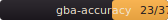

# gba-accuracy-tests

Cross-emulator accuracy benchmark for the Game Boy Advance.
Test ROM manifests, reference hashes, runner adapters, diff images, and a
static dashboard you can publish on GitHub Pages.

If you're writing a GBA emulator (in any language), you can use this to
measure where your emulator agrees with the field and where it diverges,
and you can submit your own runner adapter so future runs include your
emulator in the matrix.

[](docs/dashboard/index.html)

## Quick start

```bash
git clone https://github.com/cadfan/gba-accuracy-tests
cd gba-accuracy-tests
pip install pillow tomli            # tomli only needed on Python < 3.11
python scripts/download_roms.py     # downloads test ROMs + cleanroom BIOS
python scripts/sweep_all.py         # runs every available runner × suite × BIOS mode
python scripts/promote_tiers.py     # marks consensus hashes gold
python scripts/build_dashboard.py   # writes docs/dashboard/index.html
```

The default sweep runs whichever runners are installed locally. To run
just one combination:

```bash
python scripts/generate_refs.py --runner mgba --suite jsmolka --bios-mode cleanroom
python compare.py run --runner mgba --suite jsmolka --bios-mode cleanroom
```

`cleanroom` mode works out of the box because the
[Cult-of-GBA replacement BIOS](https://github.com/Cult-of-GBA/BIOS)
ships in this repo (MIT-licensed). For higher fidelity, drop a real
Nintendo BIOS dump at `runners/cores/gba_bios.bin` and use
`--bios-mode official`. See [BIOS.md](BIOS.md) for the full picture.

## What this is

A standardized way to:

- run a curated set of GBA test ROMs against multiple emulators
- capture each run's framebuffer as raw BGR555 bytes (always 76800 bytes)
- SHA256 each capture and compare across runners + BIOS modes
- promote a consensus hash to "gold" when ≥ 2 runners agree
- surface the disagreements in a static HTML dashboard
- give every emulator author a citable scorecard

The framework treats every emulator as a black box that takes a ROM and
some inputs and produces a framebuffer. Each emulator gets a runner
adapter (a tiny Python file) that knows how to drive *its* headless mode.

## Active runners

| Runner            | Emulator                                                       | How it works                                              | BIOS modes |
|-------------------|----------------------------------------------------------------|-----------------------------------------------------------|------------|
| `cable_club`      | [Cable Club](https://github.com/cadfan/cable-club)             | `cable-club-runner` Rust binary (built from this repo)    | all 3      |
| `mgba`            | [mGBA](https://mgba.io/)                                       | `mgba_libretro.dll` driven by `runners/libretro_host.py`  | all 3      |
| `nanoboyadvance`  | [NanoBoyAdvance](https://github.com/nba-emu/NanoBoyAdvance)    | `nba-headless` binary (built from cadfan's fork)          | all 3      |
| `skyemu`          | [SkyEmu](https://github.com/skylersaleh/SkyEmu)                | SkyEmu's built-in HTTP server, `runners/skyemu.py` shim   | all 3      |

Drop the appropriate emulator binary in `runners/cores/` (or set the
matching env var) to enable a runner. Missing runners are skipped, not
errors.

## Test suites

| Suite        | Tests | Source                                                                            | Notes                                                                                 |
|--------------|------:|-----------------------------------------------------------------------------------|---------------------------------------------------------------------------------------|
| jsmolka      |    13 | [jsmolka/gba-tests](https://github.com/jsmolka/gba-tests)                         | ARM, Thumb, BIOS, memory, save (sram/flash), NES, PPU edge cases                      |
| armwrestler  |     6 | [destoer/armwrestler-gba-fixed](https://github.com/destoer/armwrestler-gba-fixed) | ARM/Thumb instruction tests with menu navigation (DOWN + START)                       |
| fuzzarm      |     3 | [DenSinH/FuzzARM](https://github.com/DenSinH/FuzzARM)                             | 10,000-case randomized ARM/Thumb fuzz tests                                           |
| mgba-suite   |    14 | [mgba-emu/suite](https://github.com/mgba-emu/suite)                               | Memory, IO, timing, DMA, BIOS math, video, etc. ROM via Asphaltian/sgba mirror.       |
| ags-aging    |     1 | [TCRF: AGS Aging Cartridge v7.1](https://tcrf.net/AGS_Aging_Cartridge)            | Nintendo's factory hardware QA cartridge. The full sequential test pass.              |

37 test cases total. `download_roms.py` will fetch them all in under 30
seconds, with SHA256 verification on every file.

## BIOS modes

The full matrix runs each test under three different BIOS configurations:

- **`official`** — user-provided real Nintendo BIOS (you drop the file in)
- **`hle`** — emulator's own HLE implementation
- **`cleanroom`** — Cult-of-GBA MIT-licensed replacement BIOS, ships in repo

The dashboard renders one column per (runner, BIOS mode) pair so you can
see at a glance where the divergences live. See [BIOS.md](BIOS.md) for
the gory details of how each runner handles each mode.

## Reference hashes

References are stored as SHA256 hashes of raw BGR555 little-endian
framebuffer bytes (240×160 u16, 76800 bytes total). Each reference
includes provenance: emulator, version, commit, BIOS mode, ROM SHA256,
frame count, capture timestamp.

After a sweep, `scripts/promote_tiers.py` walks every test and:

- if ≥ 2 runners produce the same hash for a (test, BIOS mode), promotes
  every entry with that hash to **gold**
- if 2+ distinct hashes each have ≥ 2 votes, marks the test **contested**
- if no hash has ≥ 2 votes, marks the test **unverified**
- otherwise leaves entries as **secondary**

This is empirical tier assignment — the consensus is whatever the runners
actually agree on, not a pre-declared "X is the gold-standard emulator"
heuristic.

See [schema.md](schema.md) for the full reference format spec.

## Adding your emulator

1. Copy `runners/TEMPLATE.py` to `runners/my_emulator.py`.
2. Implement `run_test(rom_path, frames, output_path, *, inputs, completion, bios_mode)`. Output should be raw BGR555 LE bytes (76800).
3. Implement `is_available()`.
4. Run a smoke test: `python scripts/generate_refs.py --runner my_emulator --suite jsmolka --test jsmolka-arm`
5. Submit a PR. The `sweep` GitHub Action will pick it up automatically.

See [CONTRIBUTING.md](CONTRIBUTING.md) for the full adapter spec.

## How a test run works

```
              python scripts/generate_refs.py
                          │
                          ▼
       ┌──────────────────────────────────────┐
       │  load manifest.toml for the suite    │
       │  for each test:                      │
       │    expand input schedule             │
       │    pick BIOS file based on mode      │
       │    runner.run_test(...) → .bin       │
       │    sha256 → references.json entry    │
       └──────────────────────────────────────┘
                          │
                          ▼
           scripts/promote_tiers.py
                          │
                          ▼
       gold / contested / unverified marks
                          │
                          ▼
           scripts/build_dashboard.py
                          │
                          ▼
              docs/dashboard/index.html
```

Each runner is sandboxed: missing emulators don't fail the sweep, they're
just absent from the matrix. Runners can be developed in isolation —
add yours, run the smoke, and your column shows up.

## License

`runners/cores/gba_bios_cleanroom.bin` is the Cult-of-GBA replacement
BIOS, MIT-licensed by DenSinH and fleroviux — see
`runners/cores/LICENSE.Cult-of-GBA-BIOS`.

The rest of the project (runners, manifests, scripts, dashboard, this
README) is MIT-licensed under the root `LICENSE` file.

Test ROM suites are subject to their own upstream licenses. See
[ACKNOWLEDGEMENTS.md](ACKNOWLEDGEMENTS.md) for credits.
